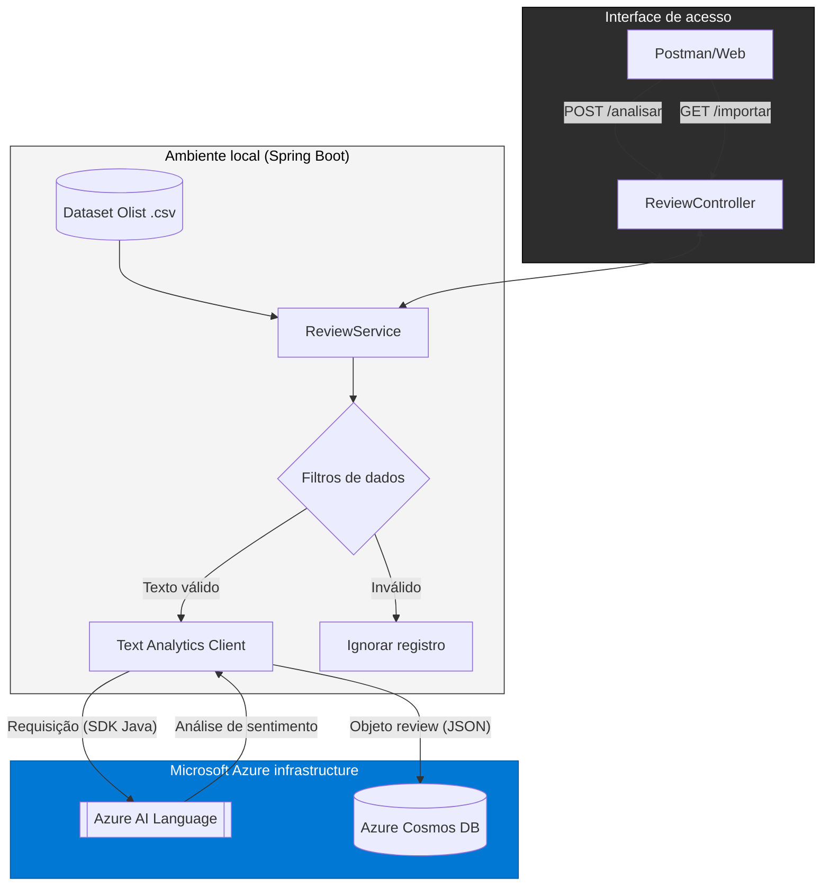

# Sentinela AI - Análise de sentimentos em larga escala (Azure & Spring Boot)

O Sentinela AI é uma solução de inteligência de dados desenvolvida para processar feedbacks de clientes em larga escala. Utilizando o ecossistema da Microsoft Azure, o projeto realiza a ingestão, análise e persistência de registros do dataset da Olist, transformando comentários brutos em métricas estratégicas.

>[!IMPORTANT]
>Se quiser ver uma documentação mais detalhada sobre a arquitetura:
>
>
>
>
>
>

## 📂 Base de dados
Os dados utilizados neste projeto foram extraídos da plataforma Kaggle, referentes ao dataset público da Olist (Brazilian E-Commerce Public Dataset). Esta base contém informações reais de milhares de pedidos e avaliações de consumidores.

## Lógica de Inteligência Artificial
O coração do projeto é a integração com o **Azure AI Language**. A lógica foi desenhada para que a IA atue como um classificador automático:

* **Interpretação de texto:** A aplicação envia o comentário bruto para a API de Linguagem da Azure.
* **Classificação de sentimento:** A IA processa o conteúdo e retorna uma etiqueta definitiva: **POSITIVE** (Positivo), **NEGATIVE** (Negativo) ou **NEUTRAL** (Neutro).

## Tecnologias e arquitetura

* **Linguagem & framework:** Java 21 com Spring Boot 3.4.12.
* **Inteligência Artificial:** Azure Cognitive Services (Text Analytics API) para classificação de sentimentos.
* **Banco de dados:** Azure Cosmos DB (NoSQL) para armazenamento escalável.
* **Processamento de dados:** OpenCSV para leitura eficiente de datasets massivos.

## 📊 Resultados da análise (Dataset Olist)

Após o processamento de **10.620 registros**, consolidamos os seguintes indicadores de satisfação:

 ## Diagrama de fluxo

## Desafios e dificuldades

**Escalabilidade e filtros de dados:** Inicialmente, tentei processar 50.000 linhas, mas enfrentei diversos problemas com filtros de dados e inconsistências no CSV original(seja por espaços demais ou caracteres estranhos). Reduzi a meta para 30.000 linhas e, após tratamentos de limpeza, 10.620 registros foram processados com sucesso.

**Configuração de banco de dados:** Tive dificuldades iniciais para conectar e manter a persistência ativa no Cosmos DB, o que exigiu refatoração da camada de repositório.

**Manipulação de JSON massivo:** Extrair e filtrar os dados específicos do arquivo JSON gerado pela Azure foi um desafio técnico que demandou o uso isolado de bibliotecas de parsing.

**Limites de nuvem:** Lidar com os limites do tier gratuito da Azure (Throttling) durante o processamento de 10k+ registros exigiu ajustes no tempo de requisição (Thread.sleep) para evitar falhas nas chamadas

---

  
 Clique aqui para ver os prints da Azure (Cosmos DB & IA)

  #### 1. Volume de dados no Azure Cosmos DB
  Neste print, mostro a execução da query SQL que comprova o processamento de mais de 10.000 registros.
  

  #### 2. Integração com Azure AI Services
  Comunicação com a API de IA para análise de sentimentos ao Cosmo db.
  

  #### 3. Métricas do Azure Cognitive Search
  Metricas que indicam quantas vezes o serviço da microssoft tentou conversar com a API e gerou status 200 (sucesso).
  * A quantidade de successful calls foi menor que o total, isso pode ocorrer devido ao processamento rapido de 30.000 linhas, ou os comentarios fossem muito grandes e a capacidade do plano gratuito pode ser reduzida para payloads grandes.
  

  #### 4. JSON com respostas geradas pela IA
  Arquivo JSON extraido do Cosmo DB depois da analise da IA.
  
 

  
 Clique aqui para perguntas sobre o projeto

  

  
 **Por que Cosmos Database e não PostgresSQL ou mySQL?**

**Jai:** Os comentários de clientes são imprevisíveis. Hoje você guarda só o texto e o sentimento, mas amanhã a Azure pode atualizar a IA e te mandar 50 novos campos de metadados. No Cosmos DB, você simplesmente salva o novo JSON sem precisar derrubar o banco para mudar o "schema", algo que no Postgres ou MySQL seria uma dor de cabeça.

**Jai:** Além do mais, o Cosmos é um banco de dados que foi feito para aguentar trafego em grande escala. Ele distribui dados pelo mundo todo rapidamente. Se a Olist cresce 10x amanhã, o Cosmos consegue aguentar o tranco apenas aumentando a taxa de transferência (RUs).
  
  

